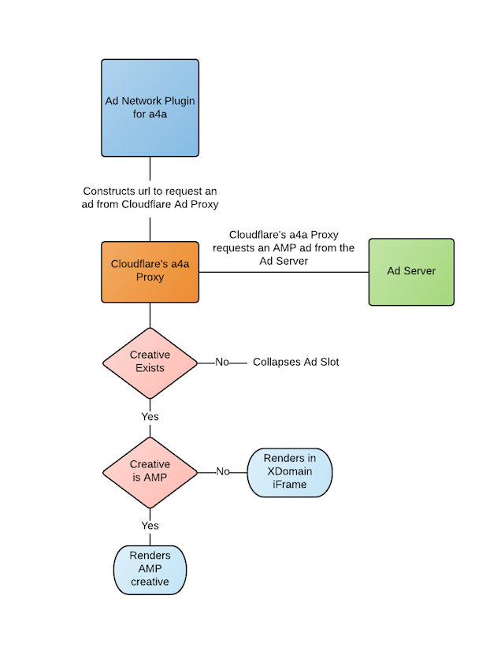

# A4A - AMP for Ads

A4A applies  AMP’s core philosophy of reliable fast performance and  great user experience to ads.

# AMP Ads

AMP ads are written in AMP format - [A4A HTML](https://github.com/google/amphtml/blob/master/extensions/amp-a4a/amp-a4a-format.md) (A variant of AMP HTML) + CSS. This means that ads can no longer have the ability to run arbitrary JavaScript - which is traditionally the number one cause of poor ad performance. Therefore, just like core AMP, the core ads JavaScript use-cases are built right into the AMP Open Source project which guarantees good behavior from ads.

# Why are AMP ads better than regular ads?

### Faster
AMP ads are faster because on AMP pages they are requested early while rendering the page and immediately displayed just before the user is about to view the ad. Reduced file size of AMP ads also increases speed.

### More Aware
On AMP pages, the AMP runtime can coordinate a mobile phone's limited resources to the right component at the right time to give the best user experience. For example, AMP ads with animations are paused when not in the current viewport.

### Lighter
AMP ads bundle commonly used ad functionality which removes bloat.  Once on the page, AMP ads also consume less resources. For example, instead of 10 trackers requesting their own information in regular ads, AMP ads collect all the information once and distribute it to any number of interested trackers.

### More Engaging
"Users can't tap on ads they can't see". Faster ads lead to higher viewability and therefore higher click through rates, which ultimately leads to higher advertiser conversions.

### Safer
It's impossible to spread malware through advertising with AMP ads. Not only are visitors safer, but advertiser brand perception cannot be negative.

### More Flexible
AMP ads are designed to work on both AMP and Non-AMP webpages,  including desktop where the ad tagging library supports it. (e.g. GPT)

# Current status

The AMP ads format spec has been [released](https://github.com/google/amphtml/blob/master/extensions/amp-a4a/amp-a4a-format.md) and any creative developer can create AMP ads. In order for ads to get preferred treatment on AMP pages, ad server support is required. Advertisers using DoubleClick or  AdSense can  already deliverprogrammatic AMP ads to publisher AMP pages. Publishers using  DFP (DoubleClick for Publishers) can already deliver their own AMP ads. Advertisers or publishers using other ad providers  can implement AMP ads with the help of a signing service like CloudFlare. Cloudflare provides AMP ad verification services, enabling any independent ad provider to deliver faster, lighter, and more engaging ads.

Here is how you can participate. If you are a:

## Publishers

If publishers want to serve their direct-sold ad formats they must create the ads in[ A4A format](https://github.com/google/amphtml/blob/master/extensions/amp-a4a/amp-a4a-format.md) (or use a creative agency), and deliver them using an AMP ad supported ad server.

## Creative Agencies

If you are a creative agency, please reach out to us via Github so we can put you in touch with publishers and advertisers who are interested in developing AMP ads.

## Ad Networks

For ad networks wanting to deliver A4A creative format can use Cloudflare’s inline signing service to cryptographically sign their creatives. The request goes through Cloudflare’s edge and fetches an AMP creative from the Ad server. If the creative is valid, it rewrites the creative with a cryptographic signature, correct headers and sends it back to the page.
If invalid, it will treat the creative as a Legacy Ad and render in an iframe using delayed ad rendering.

Figure 1: Cloudflare's A4A inline signing

For more information please refer to the [Network Implementation Guide](./Network-Impl-Guide.md)
